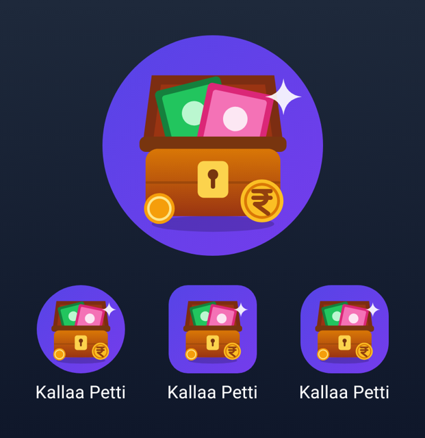
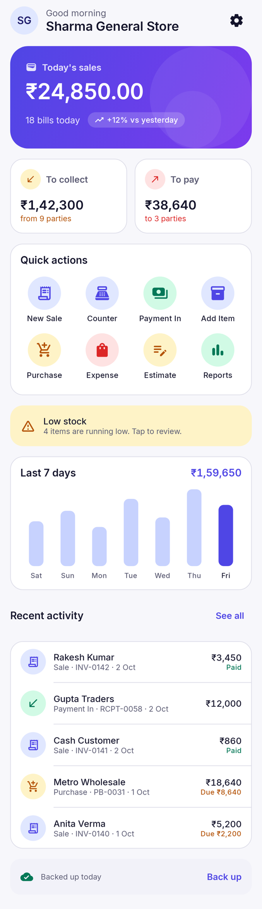
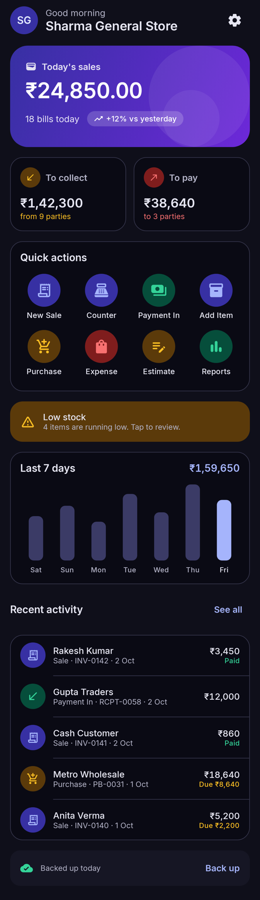
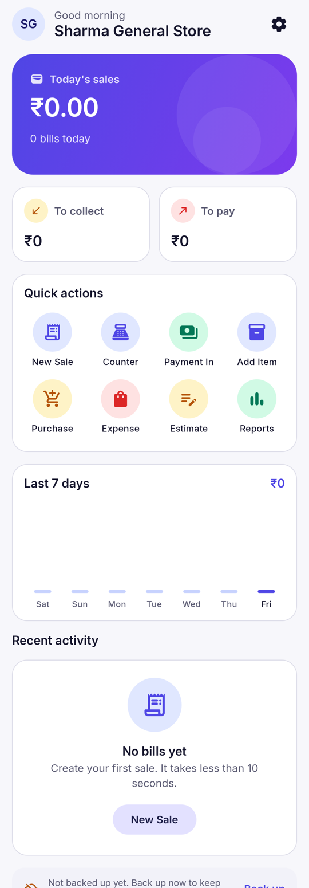
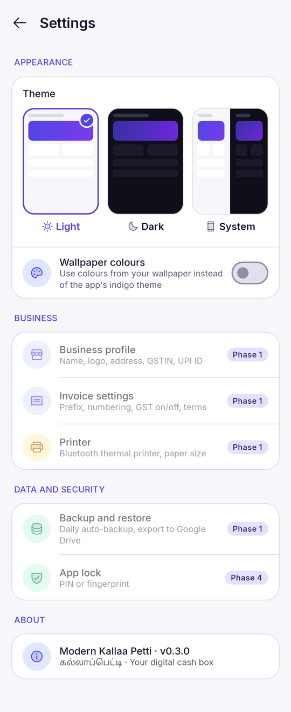
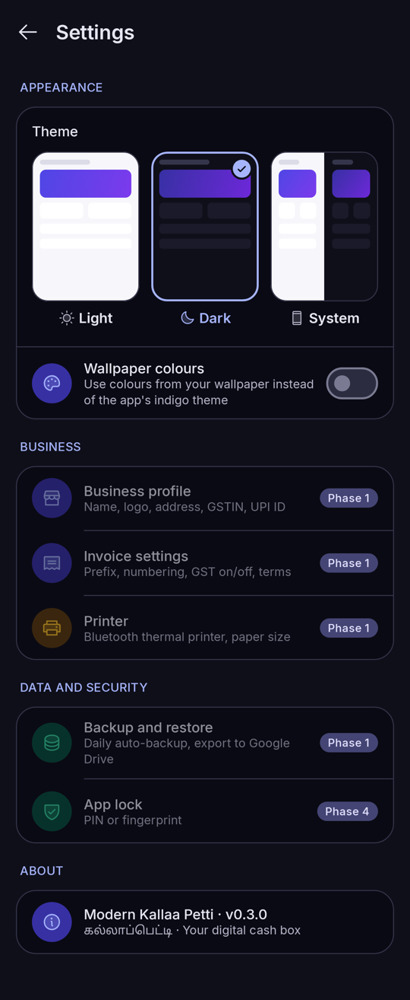
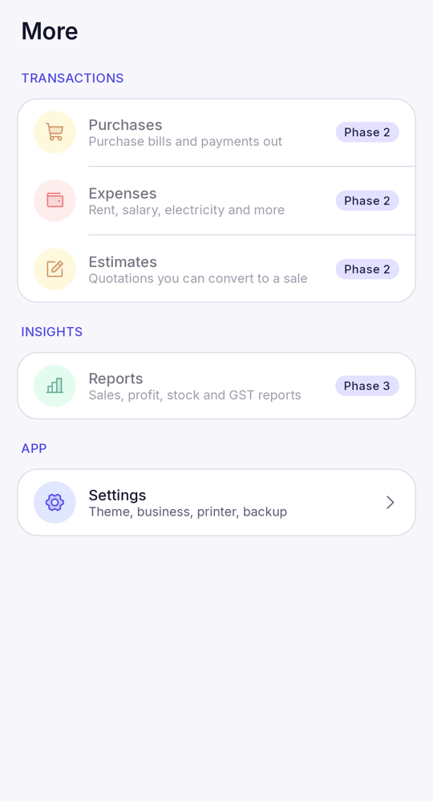

# Modern Kallaa Petti (MKP)

*கல்லாப்பெட்டி — the shop cash box, made digital.* Repository codename: EasyBill.

Offline-first billing and inventory app for Android, for GST and non-GST
shops in India. Kotlin + Jetpack Compose + Material 3. Zero running cost: all
data stays on the phone.

- Project plan: [docs/easybill_project-plan_v2.md](docs/easybill_project-plan_v2.md)
- Status: **v0.3.1** — Phase 0 complete, theme setting, Phosphor duotone icons, final brand name



| Dashboard (light) | Dashboard (dark) | Empty state |
|---|---|---|
|  |  |  |

| Settings (light) | Settings (dark) | More tab |
|---|---|---|
|  |  |  |

## Build

Requirements: Android Studio (latest stable) or JDK 21 + Android SDK (platform 37).

```bash
./gradlew assembleDebug          # APK at app/build/outputs/apk/debug/
./gradlew testDebugUnitTest :core:common:test   # unit + screenshot tests
```

Screenshot tests write PNGs to `feature/*/build/outputs/roborazzi/`.

Icons are generated from Phosphor SVGs: `python3 tools/generate_icons.py <phosphor>/assets`
(see the script header).

## Modules

| Module | Purpose |
|---|---|
| `app` | Activity, navigation, bottom bar |
| `core:model` | Plain Kotlin models (`Money` in paise, transactions) |
| `core:common` | Indian currency formatting, amount in words |
| `core:designsystem` | Theme, colours, Inter font, Phosphor icons, reusable components |
| `core:datastore` | Saved settings (theme, wallpaper colours) via Jetpack DataStore |
| `feature:dashboard` | Home dashboard |
| `feature:settings` | Settings screen and the More tab |

## Licences

- Inter font: SIL Open Font License 1.1 (`core/designsystem/FONT_LICENSE_Inter.txt`)
- Phosphor Icons: MIT (`core/designsystem/ICONS_LICENSE_Phosphor.txt`)

## Changelog

- **0.3.1** — New launcher icon: wooden kallaa petti with rupee notes and a gold ₹ coin; indigo splash icon background.
- **0.3.0** — App renamed to **Modern Kallaa Petti**; home-screen label "Kallaa Petti".
- **0.2.0** — Theme setting (Light default, Dark, System) saved on device, with a
  sun/moon toggle on the dashboard and a Settings screen with live previews;
  optional wallpaper colours (Android 12+); status bar follows the app theme;
  Phosphor duotone icon set replaces Material icons; More tab.
- **0.1.0** — Phase 0: project skeleton, design system, dashboard, CI.
