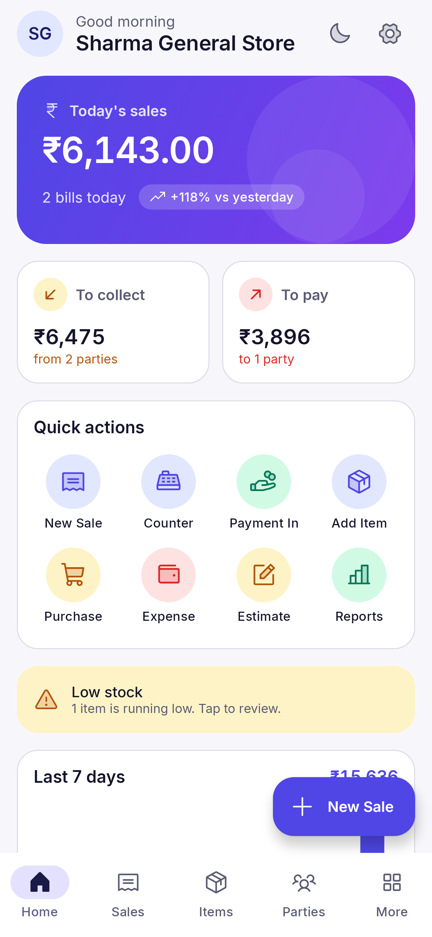
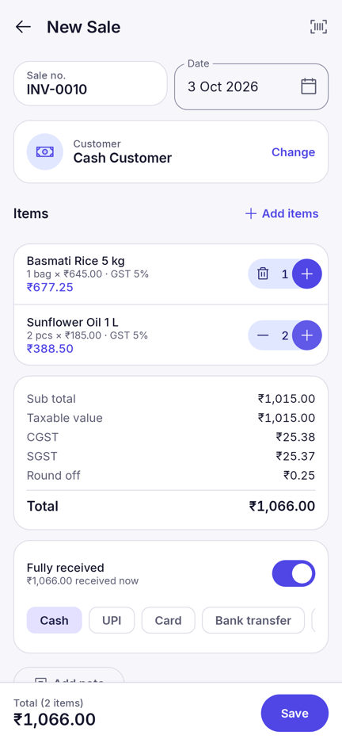
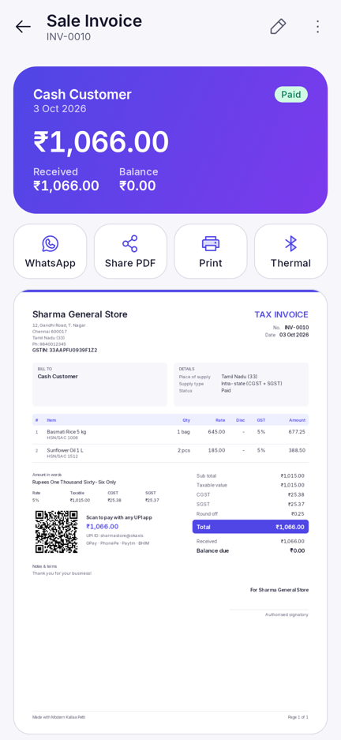
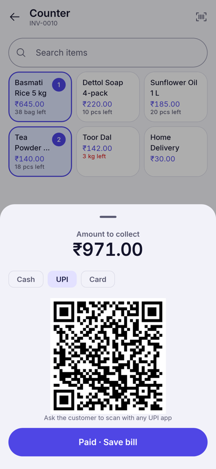
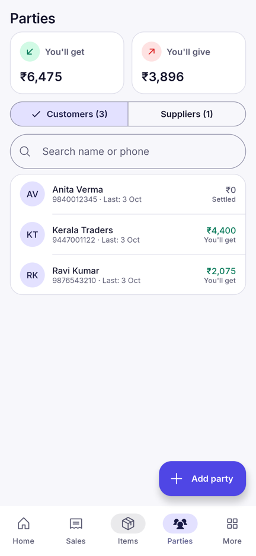
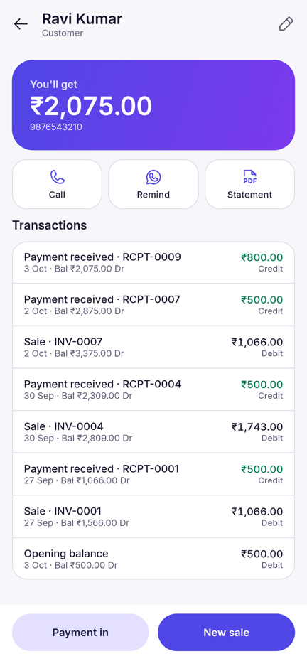
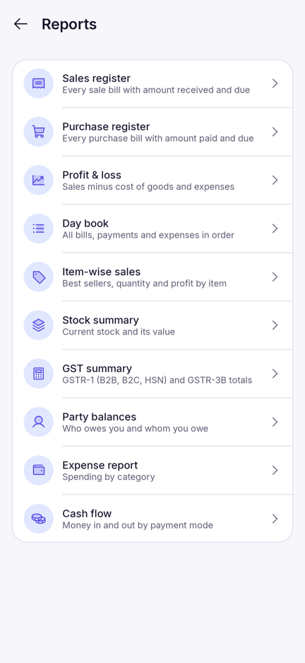
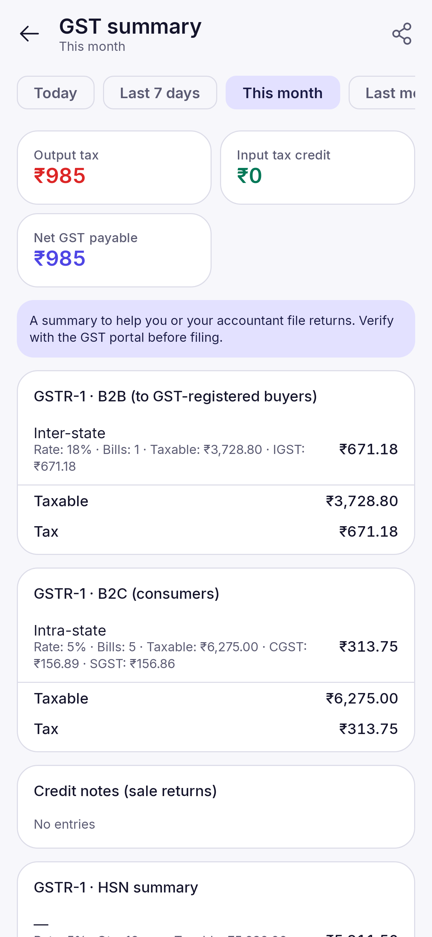

# Modern Kallaa Petti (MKP)

*கல்லாப்பெட்டி — the shop cash box, made digital.* Repository codename: EasyBill.

Free, offline-first billing, stock and accounts app for Android, for GST and
non-GST shops in India. Kotlin + Jetpack Compose + Material 3. All data stays
on the phone; there is no server and no running cost.

**Status: v1.0.0** — feature-complete for daily shop use (Phases 1–3 of the
[project plan](docs/easybill_project-plan_v2.md)). User guide:
[docs/easybill_user-guide_v1.md](docs/easybill_user-guide_v1.md).

| Dashboard | New sale | Bill + PDF | Counter (UPI QR) |
|---|---|---|---|
|  |  |  |  |

| Parties | Party ledger | Reports | GST summary |
|---|---|---|---|
|  |  |  |  |

## Features

**Billing**
- Sale invoices, purchase bills, estimates/quotations, sale returns (credit
  notes) and purchase returns (debit notes) — one fast editor for all.
- GST: CGST + SGST or IGST chosen automatically from the party's state; tax
  inclusive or exclusive prices; line discounts; round-off; Bill of Supply when
  GST is off.
- Cash customer by default; credit sales with partial payment; payment modes
  (cash, UPI, card, bank, cheque).
- Counter mode: tap item tiles, charge, show a UPI QR with the exact amount,
  change calculator, optional receipt print.
- Barcode scanning (Google code scanner, no camera permission), item search
  as you type (full-text index).
- Convert estimate → sale, duplicate a bill, make a return from a bill.

**Bills out**
- A4 PDF tax invoice with tax summary by rate, amount in words, UPI QR for the
  balance due, bank details, terms and signature block.
- Share on WhatsApp or any app, print through Android printing (Wi-Fi printers,
  Save as PDF), or print a receipt on a 58/80 mm Bluetooth thermal printer
  (ESC/POS, with UPI QR).

**Parties, stock, money**
- Customers and suppliers with opening balances, running ledger, WhatsApp
  payment reminders and PDF statements.
- Stock follows purchases, sales, returns and adjustments; low-stock alerts;
  stock history per item; purchase cost updated from the latest purchase.
- Payments in/out settle the oldest unpaid bills first; expenses by category.

**Reports** (date ranges incl. Indian FY, share as PDF or Excel/CSV)
- Sales and purchase registers, profit & loss, day book, item-wise sales,
  stock summary, GST summary (GSTR-1 B2B/B2C/HSN and GSTR-3B totals), party
  balances, expenses, cash flow.

**Safety and comfort**
- Backup to a file you choose (Google Drive, Downloads, pen drive) and restore;
  automatic daily copy inside the app (last 7 kept).
- Light / dark / system theme, Phosphor duotone icons, Tamil-friendly brand.

## Build

Requirements: Android Studio (latest stable) or JDK 21 + Android SDK (platform 37).

```bash
./gradlew assembleDebug          # debug APK: app/build/outputs/apk/debug/
./gradlew test testDebugUnitTest # all unit, database, PDF and app journey tests
./gradlew assembleRelease        # release APK (sign it, see below)
```

The app journey tests run the real app (Hilt, Room, Compose) on the JVM with
Robolectric and save screenshots to `app/build/outputs/roborazzi/`.

### Signing a release APK

Create your own key once and keep two copies of it safely. Losing it means you
cannot ship updates.

```powershell
keytool -genkeypair -v -keystore kallaa-petti-release.jks -alias kallaapetti -keyalg RSA -keysize 2048 -validity 10000
```

Then in Android Studio use **Build › Generate Signed App Bundle / APK**, or set
the four `RELEASE_*` secrets described in `.github/workflows/release.yml` and
push a tag such as `v1.0.0` to get a signed APK from GitHub Actions.

## Modules

| Module | Purpose |
|---|---|
| `app` | Activity, navigation graph, app journey tests |
| `core:model` | Domain types, GST tax engine, GSTIN check, Indian states |
| `core:common` | Indian currency formatting, amount in words |
| `core:database` | Room schema (exported in `core/database/schemas`) |
| `core:data` | Repositories, payment settlement, reports, backup |
| `core:print` | Invoice/statement PDF, thermal ESC/POS, sharing, printing |
| `core:designsystem` | Theme, Inter font, Phosphor icons, shared components |
| `core:datastore` | Device settings (theme) |
| `feature:*` | onboarding, dashboard, items, parties, billing, money, reports, settings |

## Licences

- Inter font: SIL Open Font License 1.1 (`core/designsystem/FONT_LICENSE_Inter.txt`)
- Phosphor Icons: MIT (`core/designsystem/ICONS_LICENSE_Phosphor.txt`)
- ZXing (QR codes): Apache 2.0

## Changelog

- **1.0.0** — Full app: database, onboarding with GST switch, items with stock
  and barcodes, parties with ledgers, sale/purchase/estimate/return bills,
  counter mode with UPI QR, A4 PDF, WhatsApp share, Android and Bluetooth
  thermal printing, payments, expenses, ten reports with PDF/CSV export,
  backup/restore with daily copies, invoice and printer settings, live dashboard.
- **0.3.1** — Kallaa petti launcher icon.
- **0.3.0** — Renamed to Modern Kallaa Petti.
- **0.2.0** — Theme setting and Phosphor duotone icons.
- **0.1.0** — Project skeleton, design system, dashboard, CI.
