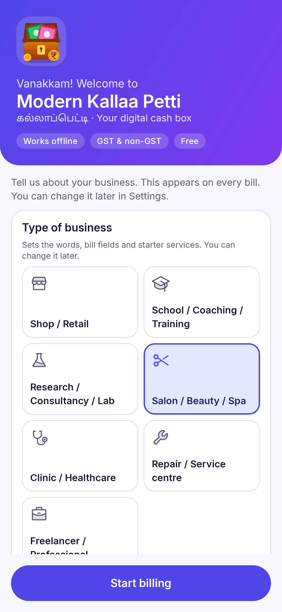
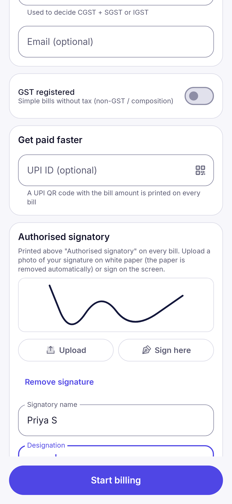
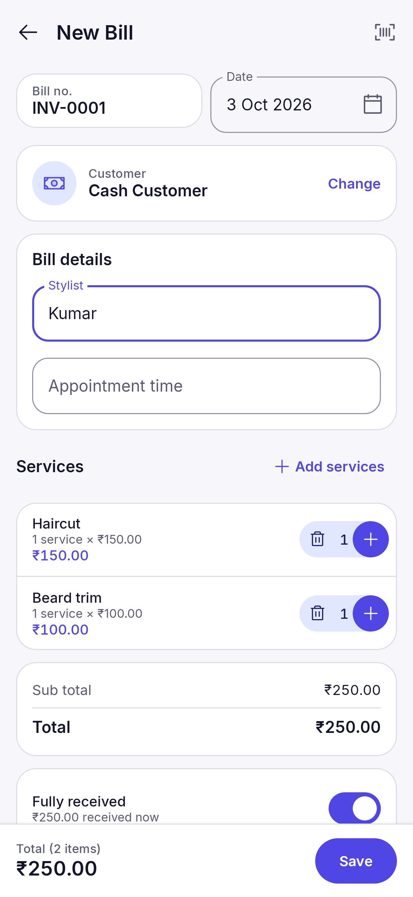
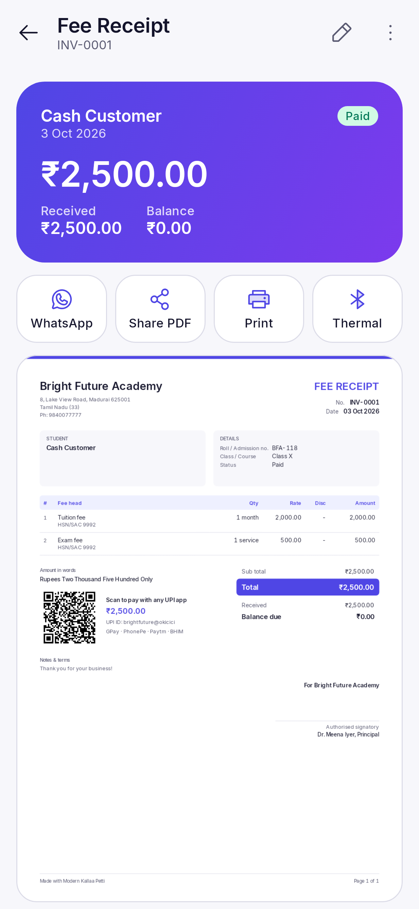

# Modern Kallaa Petti (MKP)

*கல்லாப்பெட்டி — the shop cash box, made digital.* Repository codename: EasyBill.

Free, offline-first billing, stock and accounts app for Android, for GST and
non-GST shops in India. Kotlin + Jetpack Compose + Material 3. All data stays
on the phone; there is no server and no running cost. (Android's own
Google account backup may also keep an encrypted copy of the app data, which
you can switch off in the phone's backup settings.)

**Status: v1.3.1** — feature-complete for daily shop use (Phases 1–3 of the
[project plan](docs/easybill_project-plan_v2.md)), plus business logo,
authorised signature and industry modes for service businesses
([plan](docs/easybill_industry-plan_v1.md)). User guide:
[docs/easybill_user-guide_v1.md](docs/easybill_user-guide_v1.md).

| Dashboard | New sale | Bill + PDF | Counter (UPI QR) |
|---|---|---|---|
|  |  |  |  |

| Parties | Party ledger | Reports | GST summary |
|---|---|---|---|
|  |  |  |  |

| Business type | Logo and signature | Salon bill | Fee receipt |
|---|---|---|---|
|  |  |  |  |

## Features

**Industry modes** (v1.1)
- Seven business types: Shop / Retail, School / Coaching / Training,
  Research / Consultancy / Lab, Salon / Beauty / Spa, Clinic / Healthcare,
  Repair / Service centre, Freelancer / Professional.
- Each type sets the words on screen and on bills (Student, Client, Patient;
  Fee head, Service), the bill title without GST (Fee Receipt, Bill, Job
  Invoice), whether stock is tracked, and up to four extra bill fields (e.g.
  Roll / Admission no., Stylist, Job card no., PO / Work order no.), printed in
  the bill's Details box and on thermal receipts. Optional due date for
  invoice-style types.
- Optional starter services with SAC codes and default GST rates (editable).
  With GST on, sale bills are always titled "Tax Invoice".

**Branding** (v1.1)
- Business logo (Android photo picker, no storage permission) on A4 bills,
  statements, report PDFs, the dashboard and, as a black-and-white raster
  image, on Bluetooth thermal receipts.
- Authorised signature: upload a photo on white paper (background removed
  automatically) or sign on the screen; signatory name and designation
  printed under it. Logo and signature are included in backups.

**Bill colour** (v1.3)
- Each business chooses the colour of its bills (top bar, title, table header,
  total band) in Business profile, with a live miniature preview.
- Colours are read from the uploaded logo and offered first; the first logo
  sets the colour automatically unless one was already chosen. Twelve
  ready-made colours are also available.
- Every colour is darkened if needed so white text on it meets a 4.5:1
  contrast ratio. The colour also applies to party statements and report PDFs.

**MSME / Udyam** (v1.2, optional)
- Udyam registration number (checked against the UDYAM-XX-00-0000000 format)
  and enterprise type (Micro, Small, Medium), printed under the GSTIN on bills
  and receipts.
- For micro and small enterprises, sale bills can carry a payment-term note
  citing Section 15 of the MSMED Act, 2006 (payment within the agreed period,
  not later than 45 days from acceptance). Medium enterprises are outside
  Section 15, so no note is printed for them. Switch the note off in Invoice
  settings.

**Billing**
- Sale invoices, purchase bills, estimates/quotations, sale returns (credit
  notes) and purchase returns (debit notes) — one fast editor for all.
- GST: CGST + SGST or IGST chosen automatically from the party's state; tax
  inclusive or exclusive prices; line discounts; round-off; Bill of Supply when
  GST is off.
- Cash customer by default; credit sales with partial payment; payment modes
  (cash, UPI, card, bank, cheque).
- Counter mode: tap item tiles, charge, show a UPI QR with the exact amount,
  change calculator, optional receipt print.
- Barcode scanning (Google code scanner, no camera permission), item search
  as you type (full-text index).
- Convert estimate → sale, duplicate a bill, make a return from a bill.

**Bills out**
- A4 PDF tax invoice with tax summary by rate, amount in words, UPI QR for the
  balance due, bank details, terms and signature block.
- Share on WhatsApp or any app, print through Android printing (Wi-Fi printers,
  Save as PDF), or print a receipt on a 58/80 mm Bluetooth thermal printer
  (ESC/POS, with UPI QR).

**Parties, stock, money**
- Customers and suppliers with opening balances, running ledger, WhatsApp
  payment reminders and PDF statements.
- Stock follows purchases, sales, returns and adjustments; low-stock alerts;
  stock history per item; purchase cost updated from the latest purchase.
- Payments in/out settle the oldest unpaid bills first; expenses by category.

**Reports** (date ranges incl. Indian FY, share as PDF or Excel/CSV)
- Sales and purchase registers, profit & loss, day book, item-wise sales,
  stock summary, GST summary (GSTR-1 B2B/B2C/HSN and GSTR-3B totals), party
  balances, expenses, cash flow.

**Safety and comfort**
- Backup to a file you choose (Google Drive, Downloads, pen drive) and restore;
  automatic daily copy inside the app (last 7 kept).
- Automatic copy also taken just before any restore, listed as "Before restore"
  so a wrong restore can be undone; hourly check while the app stays open.
- App lock with fingerprint, face or phone screen lock (v1.4, optional).
- Light / dark / system theme, Phosphor duotone icons, Tamil-friendly brand.

**Look and feel** (v1.4)
- Dashboard: overdue bills card, this month's top sellers with bars, today's
  summary to share, figures that count up.
- Sales list grouped by day with day totals, overdue labels and filter, and
  placeholder rows while loading.
- Coloured initials for customers and items, coloured report icons, light
  vibration on taps in the counter and item picker, a saved banner after each
  bill, animated totals and screen transitions.

## Build

Requirements: Android Studio (latest stable) or JDK 21 + Android SDK (platform 37).

```bash
./gradlew assembleDebug          # debug APK: app/build/outputs/apk/debug/
./gradlew test testDebugUnitTest # all unit, database, PDF and app journey tests
./gradlew assembleRelease        # release APK (sign it, see below)
```

The app journey tests run the real app (Hilt, Room, Compose) on the JVM with
Robolectric and save screenshots to `app/build/outputs/roborazzi/`.

### Signing a release APK

Create your own key once and keep two copies of it safely. Losing it means you
cannot ship updates.

```powershell
keytool -genkeypair -v -keystore kallaa-petti-release.jks -alias kallaapetti -keyalg RSA -keysize 2048 -validity 10000
```

Then in Android Studio use **Build › Generate Signed App Bundle / APK**, or set
the four `RELEASE_*` secrets described in `.github/workflows/release.yml` and
push a tag such as `v1.0.0` to get a signed APK from GitHub Actions.

## Modules

| Module | Purpose |
|---|---|
| `app` | Activity, navigation graph, app journey tests |
| `core:model` | Domain types, GST tax engine, GSTIN check, Indian states |
| `core:common` | Indian currency formatting, amount in words |
| `core:database` | Room schema (exported in `core/database/schemas`) |
| `core:data` | Repositories, payment settlement, reports, backup |
| `core:print` | Invoice/statement PDF, thermal ESC/POS, sharing, printing |
| `core:designsystem` | Theme, Inter font, Phosphor icons, shared components |
| `core:datastore` | Device settings (theme) |
| `feature:*` | onboarding, dashboard, items, parties, billing, money, reports, settings |

## Licences

- Inter font: SIL Open Font License 1.1 (`core/designsystem/FONT_LICENSE_Inter.txt`)
- Phosphor Icons: MIT (`core/designsystem/ICONS_LICENSE_Phosphor.txt`)
- ZXing (QR codes): Apache 2.0

## Changelog

- **1.4.0** — Second audit, richer screens and app lock.
  - New: overdue tracking (Home card, Sales filter, labels with days overdue);
    top sellers this month; share today's summary; app lock; saved banner;
    Sales list grouped by day; coloured avatars and report icons; vibration on
    taps; animated totals and screen transitions.
  - Money: sale and purchase returns now reduce what is due on the party's
    bills (database v5 with automatic migration); GSTR-3B lists nil-rated and
    exempt sales in 3.1(c) instead of 3.1(a); decimal commas ("12,50") are read
    correctly; party statement opening balance refreshes after an edit.
  - Data safety: backups include changes not yet written to the main database
    file; the copy taken before a restore is a normal backup in the list; daily
    copies are also made when the app is never closed.
  - Fixes: phone-camera logos and signatures are turned upright; WhatsApp
    numbers typed with a leading 0 open the right chat; phone search ignores
    spaces; search handles Tamil and other scripts; invoice prefixes are checked
    for blanks and duplicates; double taps on navigation and item save no
    longer open two screens or save twice; one-time items are added correctly.

- **1.3.1** — Full audit and bug fixes.
  - Crash: sharing Profit & loss or Cash flow as PDF.
  - Data safety: restore validates the backup (integrity, app version), swaps the
    database in one step and keeps the previous database as
    `before-restore.db`; double taps no longer save a payment, expense, party or
    purchase twice; amounts that overflow are refused.
  - Money: editing an old bill keeps the GST and round-off settings it was made
    under and keeps its receipt number; bill numbers stay unique; purchase
    price follows the newest purchase; duplicating an estimate no longer marks
    it converted; GST input credit excludes suppliers without a GSTIN;
    item-wise sales agree with profit and loss; day book has no 500-row cap.
  - Printing: A4 bills never cut the buyer's GSTIN, notes, MSME wording or bank
    details, and long names or large amounts no longer overlap; wide reports
    print in landscape without cut amounts; CSV amounts are numbers and text is
    protected against spreadsheet formulas; Tamil and other scripts print on
    thermal receipts (as pictures); Bluetooth printing no longer needs the
    Nearby-devices scan permission and prints one bill at a time.
  - Screens: dashboard rolls over at midnight; counter shows save errors;
    keyboard no longer hides fields; party page closes when the party is
    deleted; reminders only for customers who owe; unit editable with GST.
  - Release workflow runs the tests; CI lints every module; Android account
    backup includes the logo and signature.
- **1.3.0** — Bill colour per business, suggested from the logo, with
  ready-made colours and a contrast check; used on bills, statements and
  report PDFs; database v4 with automatic migration.
- **1.2.0** — Optional MSME (Udyam) registration with enterprise type, printed
  on bills and receipts; MSMED Act payment-term note for micro and small
  enterprises; database v3 with automatic migration. Fixed the A4 signature
  block running into the page footer when the left column (QR, bank details,
  terms) was tall.
- **1.1.0** — Business logo; authorised signature (photo or drawn) with name
  and designation; seven industry modes with their own words, bill titles,
  bill fields, due dates and starter services; logo on thermal receipts;
  database v2 with automatic migration from 1.0.0. Fixed restore on Android
  8–12 (an Android 13-only call).
- **1.0.0** — Full app: database, onboarding with GST switch, items with stock
  and barcodes, parties with ledgers, sale/purchase/estimate/return bills,
  counter mode with UPI QR, A4 PDF, WhatsApp share, Android and Bluetooth
  thermal printing, payments, expenses, ten reports with PDF/CSV export,
  backup/restore with daily copies, invoice and printer settings, live dashboard.
- **0.3.1** — Kallaa petti launcher icon.
- **0.3.0** — Renamed to Modern Kallaa Petti.
- **0.2.0** — Theme setting and Phosphor duotone icons.
- **0.1.0** — Project skeleton, design system, dashboard, CI.
